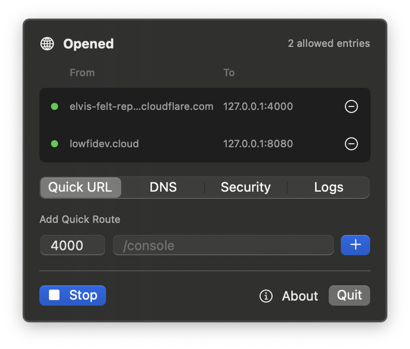

# routingflare

A small macOS menu bar app for opening public URLs from local development ports with Cloudflare Tunnel.

[Download DMG](https://github.com/ghkdqhrbals/routingflare/releases/latest) · [Project page](https://ghkdqhrbals.github.io/routingflare/)


## Screenshots




## What It Does

- Quick URL: temporary `trycloudflare.com` routes for local ports.
- DNS routes: connect your own hostname through an existing Cloudflare tunnel.
- Security: inbound IP allowlist and optional auth header.
- Logs: Cloudflare Tunnel and local proxy events.

## Development

```bash
swift test --scratch-path .build
swift run TunnelBar
```
