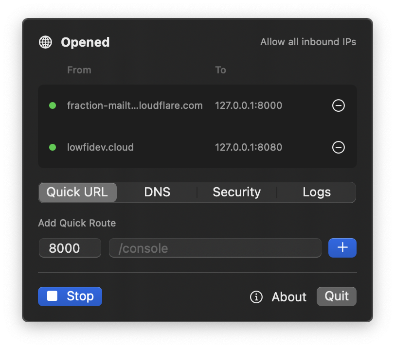
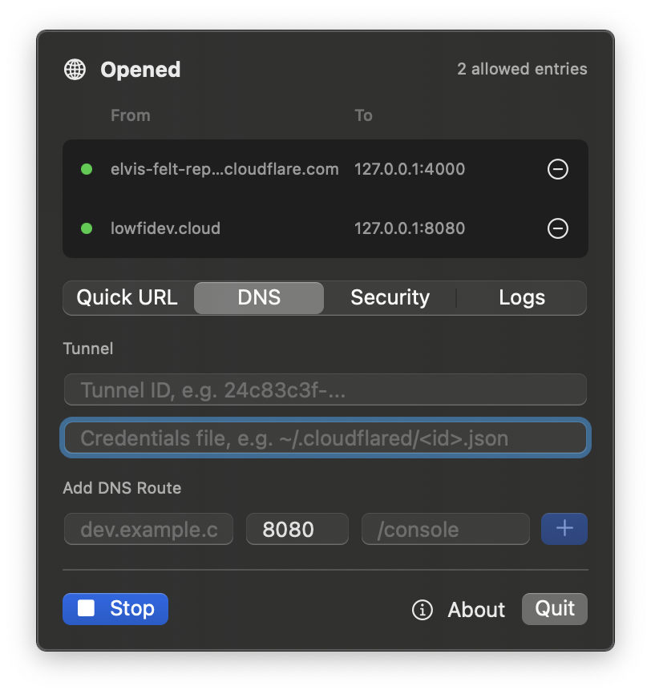
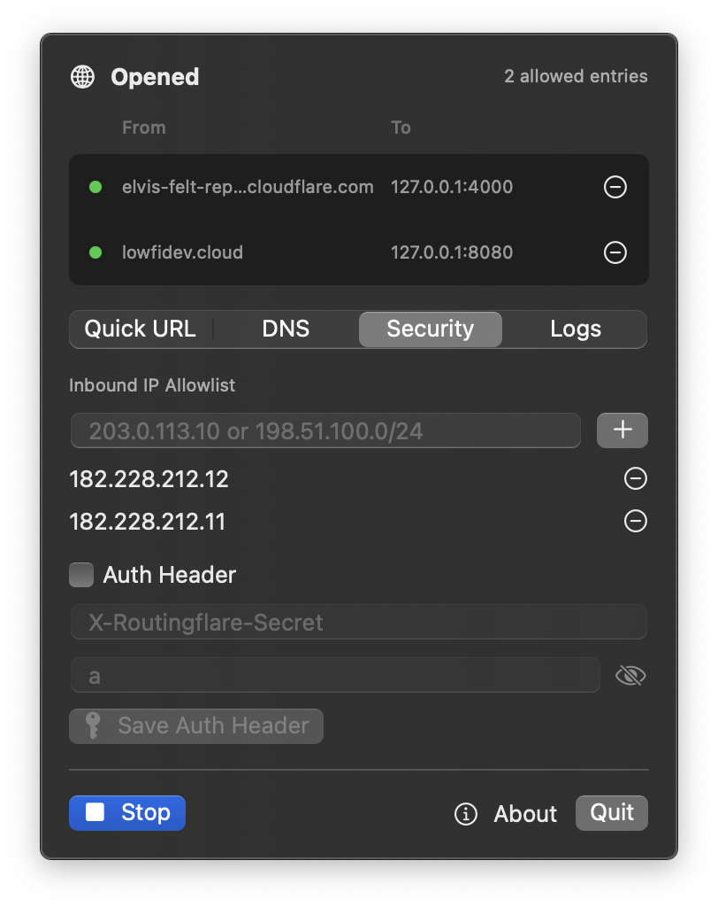

# routingflare

Open public URLs from localhost in seconds.

routingflare is a tiny macOS menu bar app for Cloudflare Tunnel. Use Quick URL for an instant random `trycloudflare.com` address, or DNS routes for your own hostname.

[Download DMG](https://github.com/ghkdqhrbals/routingflare/releases/latest) · [Project page](https://ghkdqhrbals.github.io/routingflare/)



## Features

- Quick URL: expose a local port with a temporary public URL.
- DNS: connect your own hostname to a local port and path.
- Security: inbound IP allowlist and optional auth header.
- Logs: Cloudflare Tunnel and local proxy events.
- Updates: check, install, and restart from the app.

## Screenshots





## Development

```bash
swift test --scratch-path .build
swift run TunnelBar
```
