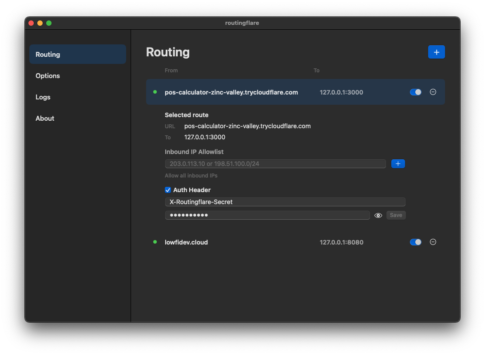
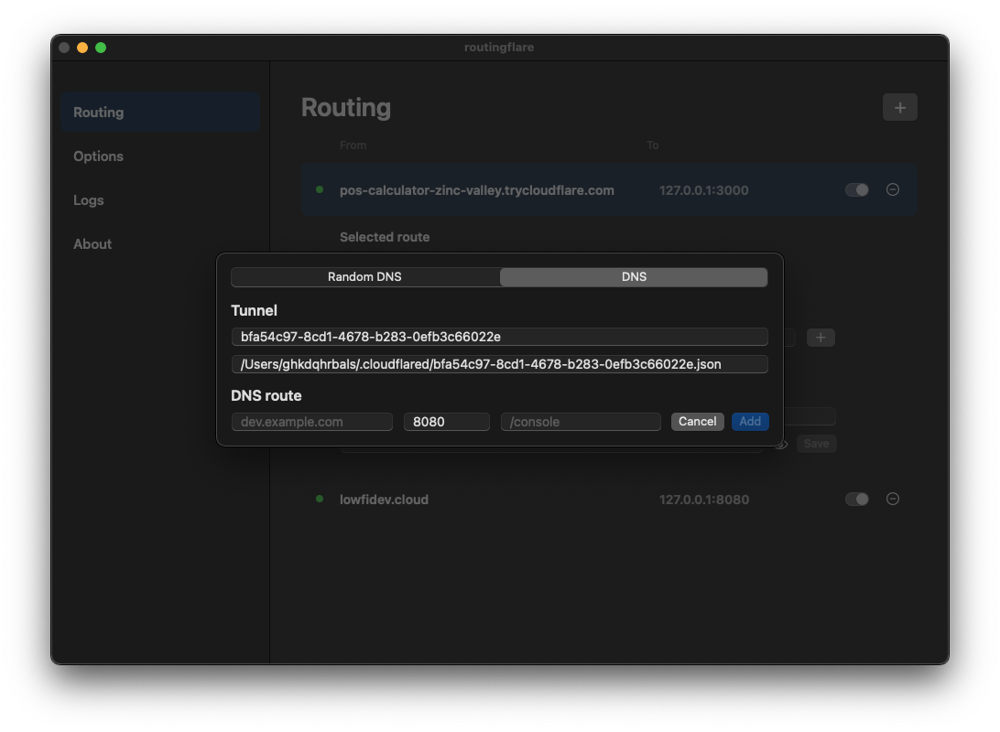
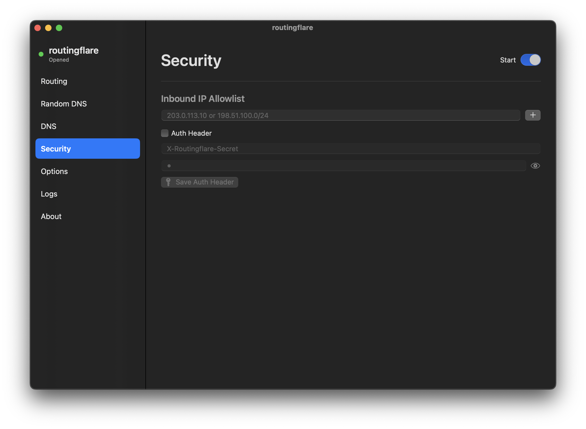

# routingflare

Open public URLs from localhost in seconds.

routingflare is a tiny macOS app for Cloudflare Tunnel. Use Random DNS for an instant `trycloudflare.com` address, or DNS routes for your own hostname.

[Download DMG](https://github.com/ghkdqhrbals/routingflare/releases/latest) · [Project page](https://ghkdqhrbals.github.io/routingflare/)



## Install

Terminal:

```bash
curl -fsSL https://raw.githubusercontent.com/ghkdqhrbals/routingflare/main/scripts/install.sh | bash
```

Install from ZIP instead of DMG:

```bash
curl -fsSL https://raw.githubusercontent.com/ghkdqhrbals/routingflare/main/scripts/install.sh | bash -s -- --zip
```

Manual install:

- Download the latest DMG or ZIP from [Releases](https://github.com/ghkdqhrbals/routingflare/releases/latest).
- Move `routingflare.app` to `/Applications`.
- Open routingflare once to install the CLI automatically.

## Features

- Random DNS: expose a local port with a temporary public URL.
- DNS: connect your own hostname to a local port and path.
- Security: inbound IP allowlist and optional auth header.
- Logs: Cloudflare Tunnel and local proxy events.
- Updates: check, install, and restart from the app.
- CLI: add, remove, list, start, stop, update, and edit settings from Terminal.

## CLI

routingflare installs its CLI automatically when the app opens:

- `~/.local/bin/routingflare` points to the CLI inside the app bundle.
- `~/.local/bin` is added to `~/.zshrc` if it is missing.

After the first app launch, open a new terminal or run:

```bash
source ~/.zshrc
```

The bundled CLI is also available directly at:

```bash
/Applications/routingflare.app/Contents/MacOS/routingflare
```

Manual fallback:

```bash
mkdir -p ~/.local/bin
ln -sf /Applications/routingflare.app/Contents/MacOS/routingflare ~/.local/bin/routingflare
```

### Common Commands

```bash
routingflare list
routingflare add random --port 3000
routingflare add random --port 3000 --path /console
routingflare add dns --host dev.example.com --port 8080 --path /console
routingflare remove random 1
routingflare remove dns 1
routingflare start
routingflare stop
routingflare settings
routingflare update
```

### Settings

```bash
routingflare settings
routingflare settings set --autostart on
routingflare settings set --cloudflared /opt/homebrew/bin/cloudflared
routingflare settings set --dns-tunnel-id <id> --dns-credentials ~/.cloudflared/<id>.json
routingflare settings allowlist add 203.0.113.10
routingflare settings allowlist remove 203.0.113.10
routingflare settings allowlist clear
routingflare settings auth on --name X-Routingflare-Secret --secret value
routingflare settings auth off
```

### How The CLI Works

The CLI writes routingflare settings to the same local preferences used by the app. Settings commands do not open the app. If routingflare is already running, the CLI sends a reload command so the app can apply the new values.
`routingflare update` runs entirely from the terminal. It checks the latest GitHub release, downloads the DMG when a newer version exists, replaces `/Applications/routingflare.app`, and refreshes the CLI symlink.

Examples:

```bash
# Create a temporary trycloudflare.com route for localhost:3000
routingflare add random --port 3000
routingflare start

# Route only a path to a local dev server
routingflare add random --port 3000 --path /admin

# Use your own hostname with an existing Cloudflare tunnel config
routingflare add dns --host dev.example.com --port 8080 --path /console
```

## Screenshots





## License

routingflare is proprietary, non-commercial software. Use, redistribution, and
modified distribution require explicit written permission and attribution.
Commercial use is prohibited without a separate written license.

See [LICENSE](LICENSE).
